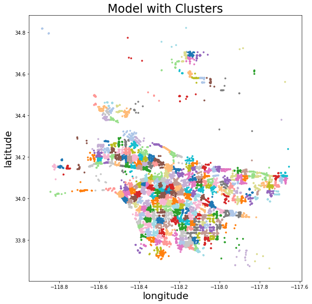

# **Utilizing Yelp Data to Predict Zip Code Affluence**

## **Presentation Link**
[Click here for presentation slides](https://docs.google.com/presentation/d/1x6mdFnOGBZWx4fPJO_OO_CF1Uf4N9m5_dsgrioAmbh8/edit?usp=sharing)

## **Flask Demo Video**  
[Click here for Flask App Demo Recording](https://drive.google.com/file/d/1YDauGdTVFCNHEwzZ-KRU7xr6gsdjCdKI/view?usp=sharing)

## **Problem Statement**
This tool will estimate the affluence of a neighborhood based on the number of $ of businesses and services (according to Yelp) in a given neighborhood ($, $$, $$$, $$$$). This tool will expect to get, as an input, a list of zip codes and will estimate the wealth of the locality. While traditional methods typically estimate wealth of a locality based on demographic characteristics (e.g. income or unemployment rate), the novelty of this approach is in its use of big data related to commercial activity and cost of product and services as an indicator for affluence.

## **Repository Contents**
- Assets  
  - `.json` files required for webscraping process
- Code   
  - [`01 - Yelp Webscraping.ipynb`](https://github.com/aejsong/Predicting-Neighborhood-Affluence-with-Yelp/blob/master/Code/01%20-%20Yelp%20Webscraping.ipynb)
  - [`02 - Yelp Data Merging & Cleaning.ipynb`](https://github.com/aejsong/Predicting-Neighborhood-Affluence-with-Yelp/blob/master/Code/02%20-%20Yelp%20Data%20Merging%20%26%20Cleaning-draft%20for%20publishing.ipynb)
  - [`03 - Yelp Adding IRS Income to Dataframe.ipynb`](https://github.com/aejsong/Predicting-Neighborhood-Affluence-with-Yelp/blob/master/Code/03%20-%20Yelp%20Adding%20IRS%20Income-draft%20for%20publishing.ipynb)
  - [`04 - Yelp Modeling.ipynb`](https://github.com/aejsong/Predicting-Neighborhood-Affluence-with-Yelp/blob/master/Code/04%20-%20Basic%20Modeling.ipynb)
  - [`05 - Yelp Further Feature Engineering and Modeling.ipynb`](https://github.com/aejsong/Predicting-Neighborhood-Affluence-with-Yelp/blob/master/Code/05%20-%20Yelp%20Further%20Feature%20Engineering%20and%20Modeling.ipynb)
  - [`A1 - Creating ZIP Code Dictionary.ipynb`](https://github.com/aejsong/Predicting-Neighborhood-Affluence-with-Yelp/blob/master/Code/A1%20-%20Creating%20ZIP%20Code%20Dictionary.ipynb)
  - [`A2 - Creating LA County Coordinate Dictionary.ipynb`](https://github.com/aejsong/Predicting-Neighborhood-Affluence-with-Yelp/blob/master/Code/A2%20-%20Creating%20LA%20County%20Coordinate%20Dictionary.ipynb)
  - [`A3 - Collecting Census Financial Data.ipynb`](https://github.com/aejsong/Predicting-Neighborhood-Affluence-with-Yelp/blob/master/Code/A3%20-%20Collecting%20Census%20Financial%20Data.ipynb)
  - [`A4 - GraphQL API.ipynb`](https://github.com/aejsong/Predicting-Neighborhood-Affluence-with-Yelp/blob/master/Code/A4%20-%20GraphQL%20API.ipynb)
- Data
  - `.csv` files acquired from webscraping process and Flask operation
- flask_app_complete  
  - Materials to launch the Flask application

## **Data Dictionary**
The dictionary for the final dataframe used for our model.

|Feature|Type|Description|
|------|----------|-------|
|**zip_code**|object|Unique zip code in dataframe.|
|**ave_agi**|float|IRS data on average adjusted gross income for a zip code.|
|**count**|int|Number of businesses in a zip code.|
|**latitude**|float|Latitude location of zip code.|
|**longitude**|float|Longitude location of zip code.|
|**price**|float|Average number of $ for all businesses in a zip code.|
|**price*rating**|float|An engineered feature that multiplies price and rating together for each business and then averages all of the businesses together in that zip code.|
|**rating**|float|Average star rating (out of 5) for all businesses in a zip code.|
|**review_count**|float|Average number of review counts for all businesses in a zip code.|
|**cluster_{#}**|int|Cluster number that unsupervised learning grouped in.|

## **Executive Summary**
Commercial activity on Yelp can predict the median affluence of a neighborhood. However, the prediction has bias when there are less than 50 businesses in a zip code area. A model based on only Yelp and income data has a hard time identifying commercial areas vs. more affluent neighborhoods with less commercial activity. For the most part, a model with heavy unsupervised learning provides very accurate results.

__Basic Modeling__  

|model|RMSE Train|RMSE Test|R2 Train|R2 Test|pipeline R2 test|  
| --- | --- | --- | --- | ---|---|  
|Linear Regression| 0.29|0.26|0.45|0.50|0.33|  
|KNN Regression| 0.26|0.32|0.58|0.29|0.34|  
|Decision Tree Regression| 0|0..38|1|0.008|0.13|  
|Baggin Regression| 0.12|0.28|0.90|0.46|0.55|  
|Random Forest Regression| 0.13|0.27|0.89|0.50|0.53|
|Adaboost Regression| 0.20|0.26|0.74|0.53|0.51|
|support vector Regression| 0.09|0.38|0.94|-0.02|-0.02|
|XGB Regression| 0.12|0.28|0.90|0.42|0.42|

__Unsupervised/Supervised Modeling__

|model|RMSE Train|RMSE Test|R2 Train|R2 Test|  
| --- | --- | --- | --- | ---|
|Linear Regression|RMSE Train|RMSE Test|R2 Train|0.81|

  
Residuals of actual median income vs. predicted median income.

 
 

  
Clustering / Unsupervised learning based off of latitude and longitude.

## **Conclusions & Recommendations**
Utilizing Yelp data and income data can predict the median affluence of a neighborhood. Inconsistencies in either models may provide real-world insight because over-predicted income may indicate gentrification and income inequality while under-predicted income may indicate affluent, primarily residential areas. Neither mischaracterization indicates our model is performing poorly.

We recommend that for future use, Flask App should be automated so a user can input a zip code where the app then scrapes data, cleans data, updates model with new data, save model, and use updated model to make a better prediction. This will require some edits in our current functions and add to our Flask code. After this, we can release the app where users will input zip codes and introduce data from all over the world, therefore improving our model. Introducing GeoJSON to outline zip code boundaries when requested may also improve map visual. In order to better predict affluence in zip codes where neighborhoods are more affluent+have little commercial activity and zip codes where neighborhoods are less affluence+have an increasing amount of commercial activity, it would also be recommended to set up an automated scraper that can take housing information from Zillow/RedFin, etc. and include those data in our model as well.

## **Sources**
https://www.yelp.com/
https://www.yelp.com/developers/documentation/v3/business_search
https://www.openstreetmap.org/#map=4/38.01/-95.84
https://data.census.gov/cedsci/
https://www.kdnuggets.com/2019/04/building-flask-api-automatically-extract-named-entities-spacy.html
https://github.com/irinhwng/Yelp
